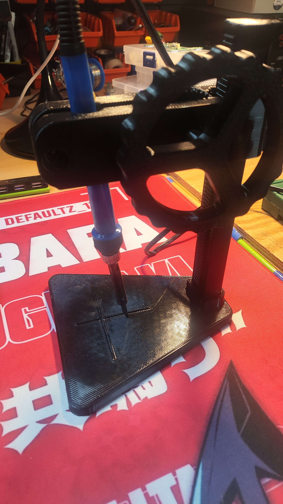
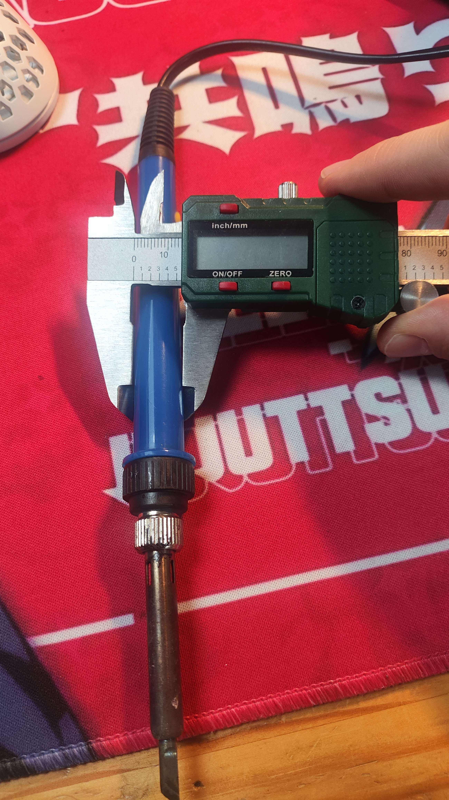
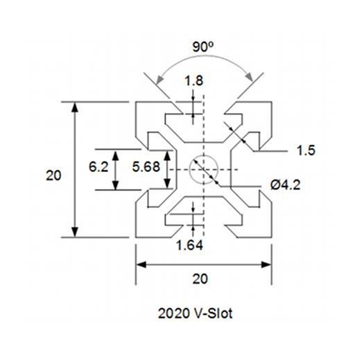
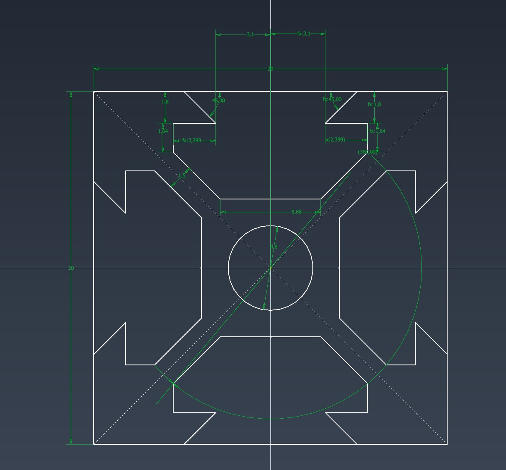
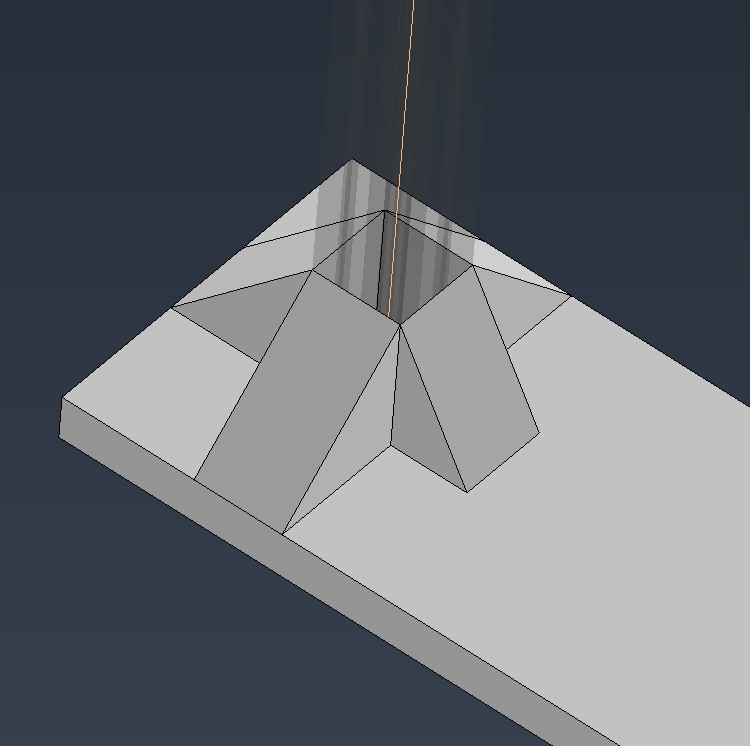
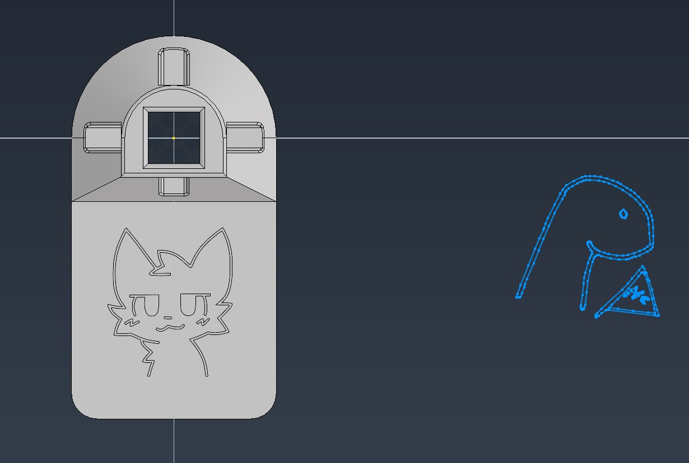
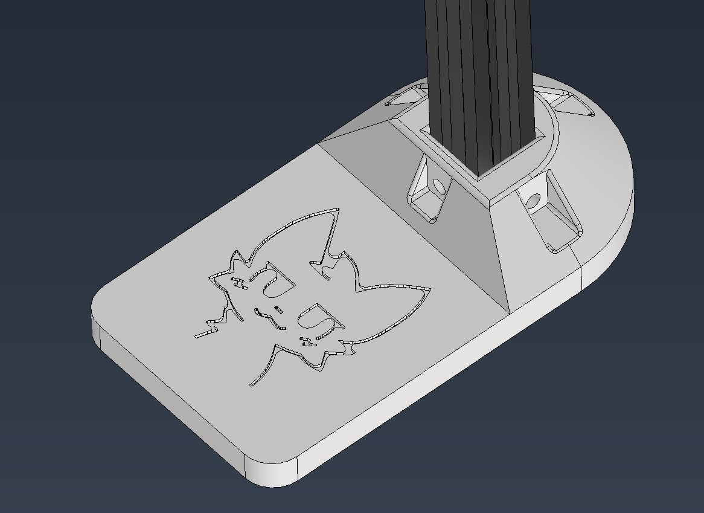
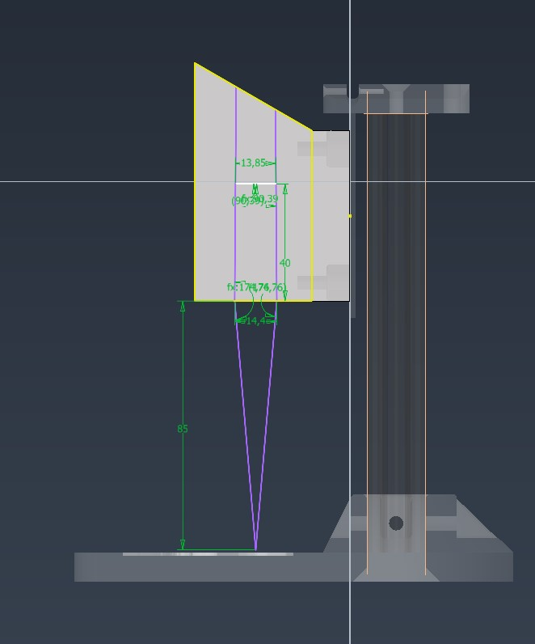
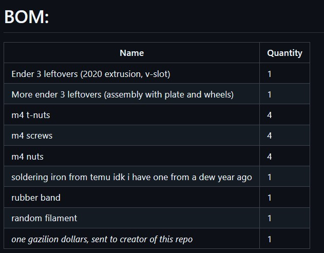

# July 06: Measuring everything, creating repo

So after finding out that system that is 3d printer, has 3d printer gear and overall is junky, cant be straight... I started designing my own lol
Also as you can probrably tell i got burned out by my other project, Evangelion turbo :)
So enjoy this simple one-day-project!

Heres photos!

**Total time spent: 0.6 hours**

# July 06: Base
Okay, so finding dimensions for 2020 vslot extrusion wasnt hard.

I have something... But it doesnt look sturdy, and im trying to do it as sturdy as posible!
I think i will try to use resolve...

Holed for the extrusion to clamp into something, so it will be *please be* straight. 
I made it pass throug, so if you will be cuting extrusion yourself, you wont have to worry about beeing straight.

Also das Katze picture! Added a looot of filets manually, so it please will print okay and clearishS

Heres photos!

**Total time spent: 1.4 hours**

# July 06: The rest lol

Firstly i forgot to account for nuts lol.
Overall i think it is done.

I totally completly didnt watch youtube in background :)

This experience was very relaxing, i like caddinggg!

Heres photos!

**Total time spent: 3.4 hours**

# July 06: BOM, readme, adn sent for review

BOM? lol. Yea, bom.
Some readme and sent for rewiev!

Heres photos!

**Total time spent: 0.4 hours**