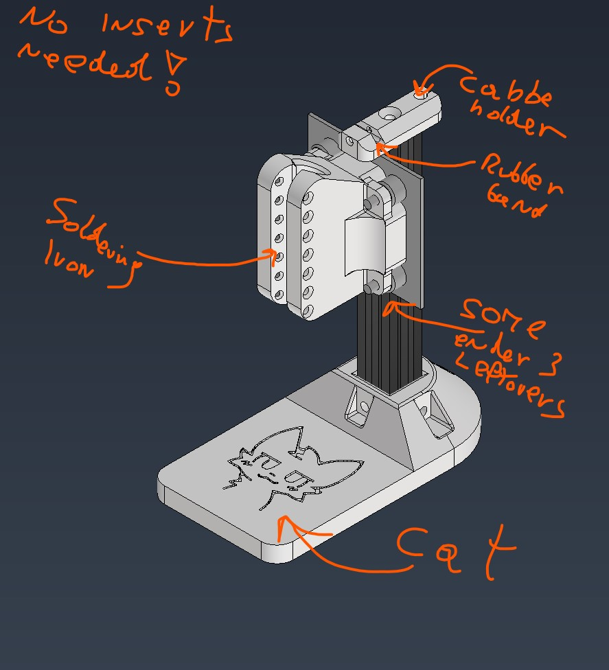

# Ender press - Totally most complicated 4718064789126790342 hours put in project, costs six/seven gazilion dollarzz
It is interst press, that i made from some ender 3 parts. 
I was tired of putting insert by hand. 
I 3d printer one insert press but it was hella junky and completly not straight! 
*I got burned out by soldering, debuging and STM32, so here a lil project of mine!*

## Image!

# BOM:
| Name | Quantity |
|---------------|---------------|
| Ender 3 leftovers (2020 extrusion, v-slot) | 1 |
| More ender 3 leftovers (assembly with plate and wheels) | 1 |
| m4 t-nuts | 4 |
| m4 screws | 4 |
| m4 nuts | 4 |
| soldering iron from temu idk i have one from a dew year ago | 1 |
| rubber band | 1 |
| random filament | 1 |
| *one gazilion dollars, sent to creator of this repo* | 1 |

##[Also on Forge (HackClub)](https://forge.hackclub.com/projects/710)